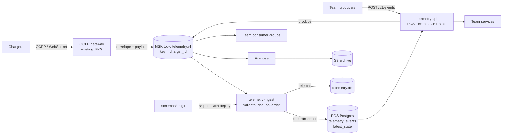

# Charger telemetry platform

Ingests OCPP charger telemetry, keeps the history, and serves the latest known state of any charger. Other teams add event types and start reading state through pull requests, without a ticket to the cloud team. To run it, see [section 3](#3-runnable-slice).

## 1. Architecture



**Events in.** The existing OCPP gateway turns each charger message into an event: a small envelope the platform owns (`event_id`, `charger_id`, `connector_id`, `event_type`, `schema_version`, `occurred_at`) and a `payload` whose shape the owning team defines in `schemas/<type>/v<N>.json`. It produces to one Kafka topic keyed by `charger_id`, so each charger's events stay in order on one partition. Team services without a Kafka client use `POST /v1/events`, which produces to the same topic.

**Processing.** The ingest consumer validates the envelope and payload, then writes history and latest state in one Postgres transaction. Events that can never succeed (invalid, or an id reused for different content) go to a dead-letter topic with an alert to the team that owns the event type. Everything else, such as a database outage, is retried.

**History** lives in Postgres for a 7-day hot window, partitioned by day, and in an S3 archive for the long term, with retention set per event type.

**Latest state** lives in Postgres, one row per `(charger_id, connector_id, event_type)`.

```
telemetry_events  PK (charger_id, event_id) | connector_id | event_type | schema_version
                  occurred_at (charger clock) | received_at | payload jsonb
latest_state      PK (charger_id, connector_id, event_type)
                  occurred_at | event_id | schema_version | payload jsonb
```

Latest state is keyed per event type so that a late meter reading can't be dropped because of a newer status change, or roll that status back. It also means a new event type gets history and latest state with no migration and no code change.

**Duplicates and out-of-order events** are normal here: OCPP and Kafka both deliver at least once, and chargers buffer readings while offline. Two statements in [store.go](internal/store/store.go) handle them:

```sql
-- history: a known (charger_id, event_id) is a no-op
INSERT INTO telemetry_events (...) VALUES (...) ON CONFLICT (charger_id, event_id) DO NOTHING;

-- latest state: only move forward
INSERT INTO latest_state (...) VALUES (...)
ON CONFLICT (charger_id, connector_id, event_type) DO UPDATE SET ...
WHERE (excluded.occurred_at, excluded.event_id) > (latest_state.occurred_at, latest_state.event_id);
```

- A late event is kept in history but never rolls state back.
- Ordering uses the charger's clock, because arrival order can't be trusted after a reconnect. Timestamps more than 5 minutes in the future are rejected.
- Ids only need to be unique per charger. An id reused with different content is rejected as a producer bug.
- If a producer sends no `event_id`, ingest derives one from the event's content, so a retry gets the same id.

**Lock-in.** The core runs on open protocols (Postgres, the Kafka protocol, Kubernetes), so RDS and MSK can be swapped for any Postgres and any Kafka. The AWS-specific parts sit at the edges: IAM auth, Firehose and S3. I kept Kinesis and DynamoDB out of the core for that reason, accepting that MSK means more to operate.

## 2. Platform and developer experience

The aim: a team with a new need gets it through a pull request that its own team approves, the same day. The cloud team reviews only changes that are hard to undo; CI checks the rest.

### Adding an event type

Say Field Ops wants to publish charger faults.

1. They copy an existing folder to `schemas/error_notification/`: a JSON Schema `v1.json` with three platform fields (`x-owner`, `x-retention-days`, `x-contains-pii`) and an `example.json`.
2. They open a PR. CI runs [`platformcheck`](tools/platformcheck/main.go): it compiles the schema, runs the example through the real ingest code, checks compatibility, and comments on the PR saying whether the cloud team needs to review.
3. Someone from `@acme/field-ops` approves. An [approvals check](.github/workflows/approvals.yml) confirms the team named in `x-owner` approved. The PR merges.
4. The normal pipeline deploys it. Their events then appear in history and under `/v1/chargers/{id}/state`, with no platform code changes. `make demo` does exactly this.

### Reading latest state for the first time

The team adds [`consumers/<name>.yaml`](consumers/billing.yaml) with its service account, the event types it reads, and an access mode. On merge, [Terraform](infra/consumers.tf) turns the file into access, so nobody on the cloud team writes Terraform for it.

- `api`: a client of the read API with a rate limit, authenticated by the service account token.
- `stream`: an IAM role with read access to the topic and to consumer groups under the team's own prefix, so it can replay at its own pace.

### What is self-serve and what needs review

| Change | Approved by | Why |
|---|---|---|
| New event type, optional field or enum value | Owning team | Additive; consumers must ignore what they don't know |
| New consumer, up to 100 rps | Consumer's team | Scoped to its own identity; no database access |
| Breaking change to a published version | Nobody; CI fails | Ship it as `v2` instead |
| New major version | Owner + cloud team | Every consumer has to migrate |
| Retention change, or rate limit above 100 rps | Owner + cloud team | Shared cost and capacity; lowering retention deletes archived data |
| Personal data | Blocked by CI | Nothing yet restricts who can read it: every stream consumer reads the topic, and the API has no per-type access. See section 5 |

A person reviews when a mistake would be irreversible or would land on another team; CI covers the rest. Schemas may only use JSON Schema keywords the compatibility checker understands, so every change to a contract is one it can evaluate.

### Where the line is, and how it holds

The platform owns the envelope, ingest, dedup and ordering, storage, the read API and its SLO, and the paved road. Product teams own their payload schemas, producers and consumers, and they are paged for their own dead-letter events and consumer lag.

- Teams never get database access; they read through the API or their own consumer group, so the platform can change its tables without breaking anyone. Services log in to the database with their IAM role instead of a password (RDS IAM authentication), so there is no password to hand out, and access is a single IAM permission. A policy check on every Terraform plan (designed, not built) rejects that permission for any role outside the platform.
- The envelope rejects unknown fields, so extra data has to go in a payload with an owner and a schema.
- Ownership lives in the files themselves (`x-owner`, `owner:`). The approvals check enforces it, and CODEOWNERS protects the platform code and the checks themselves.

### Safe by default

- Compatibility is checked on every PR, so a breaking change always arrives as a new version that consumers move to on their own schedule.
- One producer's bad events go to the dead-letter topic with an alert to its owner, and nobody else's events wait.
- Each consumer has its own consumer group and API budget, so a heavy consumer only slows itself down.
- Registrations double as a dependency map: before retiring `v1`, an owner can see exactly who reads it.

### Adoption, and knowing it works

I'd start with one pilot team that has a real need, such as support tooling that wants live connector status, and let their friction set the next piece of work. Copying a folder and opening a PR has to be easier than asking in Slack. At ATP I onboarded three developer teams onto a new platform through workshops and troubleshooting sessions, reaching 23 active developers in the first month.

What I'd measure:

- Time from a team's first PR to its first event in production (target: same day).
- Share of schema and consumer PRs merged without cloud-team review.
- Tickets and database-access requests about telemetry (should trend to zero).
- Freshness: 99% of events applied within 10 seconds of reaching Kafka.

The warning sign is a team keeping its own copy of the data or reading from the gateway directly. That means the platform failed them.

## 3. Runnable slice

One Go binary with the HTTP ingest path and the read API, on Postgres. Docker is the only requirement.

```bash
make up      # Postgres + the service on :8080
make demo    # duplicate, out-of-order, new event type, rejected event (needs curl and jq)
make test    # includes the dedup and ordering tests against real Postgres

curl -s localhost:8080/v1/events -d '{
  "event_id": "gw-1", "charger_id": "DK-CPH-000123", "connector_id": 1,
  "event_type": "status_notification", "occurred_at": "'"$(date -u +%Y-%m-%dT%H:%M:%SZ)"'",
  "payload": {"status": "Charging", "error_code": "NoError"}}'

curl -s localhost:8080/v1/chargers/DK-CPH-000123/state
```

Endpoints: `POST /v1/events`, `GET /v1/chargers/{id}/state`, `GET /v1/chargers/{id}/events`, `GET /v1/event-types`. The Kafka consumer, API authentication, the deployment manifests (ArgoCD, Argo Rollouts) and the infrastructure policies are designed but not built. The Terraform validates and plans but has never been applied.

## 4. Operations

**Infrastructure.** Terraform with one state per environment. GitHub Actions posts the plan on the PR and applies on merge, authenticating to AWS with OIDC, so CI holds no long-lived keys.

**A safe deploy.** The deployment is designed but not in this repo. CI would push the image to ECR and update its tag in Git, and ArgoCD would sync the cluster to Git, running the ingest consumer and the API as separate workloads.

1. Migrations are expand-only and run before the new code, so the old version keeps working.
2. The new ingest version starts as a single canary pod (Argo Rollouts), gated on its own error rate, dead-letter rate and event age.
3. It is promoted after 10 clean minutes, or rolled back automatically.

**Rollback.** Revert in git and let ArgoCD sync. That fixes the code, but not data the bad release already wrote, and replaying Kafka alone won't help because ingest skips events it has already stored. When a release did write bad data, an operator repairs it as a deliberate step, since most rollbacks don't need it and it deletes data:

1. Stop the ingest consumer.
2. Run [`RepairWindow`](internal/store/store.go) for the release's time window. It deletes the events stored during that window and restores the state from before it.
3. Reset the consumer group to the Kafka offset where the release started, and start the consumer again. The fixed code processes those events again.

Today `RepairWindow` is a tested function with no command around it; wrapping these steps in one command is on the "build next" list.

**Secrets.** Services authenticate to RDS with short-lived IAM tokens, so there is no database password. The few remaining secrets come from AWS Secrets Manager through External Secrets Operator, the same setup I run on AKS with Key Vault today.

**Alerts** (Datadog). Three conditions page:

- Ingest lag above 60 seconds for 5 minutes.
- A jump in chargers with no OCPP heartbeat for 15 minutes (catches gateway or network failures).
- Read API errors or latency against the SLO.

Dead-letter rates (routed to the owning team) and database headroom raise tickets instead of pages.

## 5. Trade-offs

**Assumed.** The OCPP gateway already exists, because handling the protocol is the core of the charge point management product rather than part of a telemetry platform. Charger clocks are mostly right. For sizing, roughly 1,000 events per second (50,000 connectors reporting every minute), though I don't know the real numbers.

**Left out on purpose.**

- Kafka in the slice: the HTTP path calls the same processing function a consumer would.
- API authentication and producer registration, so any client can currently send any event type.
- Handling personal data: its own topic, per-type authorization on the API, a separate archive, and erasure tooling. Until those exist, CI blocks PII event types.
- An accepted-events topic fed through an outbox, so the archive and stream consumers only see validated, deduplicated events.
- History partitioning, the S3 archive and multi-region.

**What breaks first at 10x.**

1. The single RDS writer, at one transaction per event. Fix: batch each Kafka poll into one insert and one upsert.
2. Vacuum pressure on `latest_state`, since every update leaves a dead row.
3. Postgres storage for history. Fix: a shorter hot window, then move latest state to a keyed store or shard by charger.

Kafka scales by partitions, so I'd over-provision them from the start; adding partitions later reshuffles charger ordering.

**What I'd build next.**

1. The Kafka consumer, with the dead-letter topic and batching.
2. API authentication and producer registration.
3. The accepted-events topic, and a one-command repair for bad releases.
